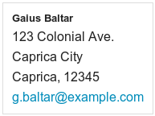

.. _examples:

========
Examples
========

Here you will find some random examples how to use Foundation framework within TYPO3 project.

Accordion for DateMenu in News extension
========================================

If you use news_ extension version 3.0.0, you can easily override any Fluid template used by the extension.
All you need is to define the path to your custom templates in TypoScript, like:

.. code-block:: ts

  plugin.tx_news {
    view {
      layoutRootPaths.101 = EXT:myext/Resources/Private/news/Layouts/
      partialRootPaths.101 = EXT:myext/Resources/Private/news/Partials/
      templateRootPaths.101 = EXT:myext/Resources/Private/news/Templates/
    }
  }

Then, you can create a custom template for DateMenu in ``EXT:myext/Resources/Private/news/Templates/News/DateMenu.html``:

.. code-block:: html

  {namespace n=Tx_News_ViewHelpers}
  <f:layout name="General" />

  <f:section name="content">
    

      <dl class="accordion" data-accordion>
        <f:for each="{data.single}" key="year" as="months" iteration="iter">
          <dd class="{f:if(condition: '{year} == {overwriteDemand.year}', then: 'active')}
                     {f:if(condition: '{0:iter.index, 1:overwriteDemand.year} == {0:0, 1:0}',
                          then: 'active')}">
            <a href="#a{year}">{year}</a>
            

              <ul class="side-nav">
                <f:for each="{months}" key="month" as="count">
                  <f:if condition="{0:year, 1:month} == {0:overwriteDemand.year,
                                                         1:overwriteDemand.month}">
                    <f:then>
                      <li class="item active">
                    </f:then>
                    <f:else>
                      <li class="item">
                    </f:else>
                  </f:if>
                    <f:link.action pageUid="{listPid}"
                                   arguments="{overwriteDemand:{year: year, month: month}}">
                      <f:translate key="month.{month}" /> {year} ({count})
                    </f:link.action>
                  </li>
                </f:for>
              </ul>
            

          </dd>
        </f:for>
      </dl>
    

  </f:section>

.. _news: http://typo3.org/extensions/repository/view/news

Rendering vCards unsing microformats
====================================

Foundation includes some default CSS styling for vCard microformats.
An easy way to render vCards is to use tt_address_ extension.
The default template provided with tt_address already renders microformats, and you can customize it
as you need.

.. _tt_address: http://typo3.org/extensions/repository/view/tt_address
