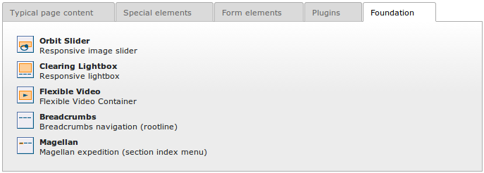

============
Users manual
============

Using Foundation Framework
==========================

Once :ref:`installed <installation>` and :ref:`configured <configuration>`,
Foundation gives you a lot of CSS classes and
JavaScript functions you can integrate to your website. 
In fact, you can use anything that is in the `official documentation`_.

You simply need to integrate the needed markups and CSS classes to 
your HTML or Fluid templates. Here are some :ref:`examples`.

However, to simplify the process, we already provide you some 
plugins you can directly integrate to the content of your website.
Those plugins are listed when you insert a new content element,
under the *Foundation* tab:

.. _official documentation: http://foundation.zurb.com/docs/

.. _orbit-slider:

Orbit Slider
============

Orbit is an easy, powerful, responsive image slider that allows users to swipe on touch-enabled devices.

    Orbit responsive image slider (screenshot)

    This screenshot, borrowed from official Foundation website, shows an example orbit slider,
    with navigation arrows, bullets, slide number, caption, and progress bar.

Plugin settings are very similar to images content element. In fact, you can switch
between orbit slider and images content elements without changing anything in the configuration.
Optional captions can be added in the description field of each image. You can also
set a optional link on any image.

You will find more information about the `Orbit slider`_ on the official Foundation documentation.
To configure different options for the Orbit slider, see :ref:`orbit-configuration` in the :ref:`admin-manual`.

.. _Orbit slider: http://foundation.zurb.com/docs/components/orbit.html

.. _clearing-lightbox:

Clearing Lightbox
=================

Clearing makes it easy to create responsive lightboxes with any size image.
It can be a good alternative to Orbit, when you need to handle variable-height content.

    Clearing lightbox (screenshot)

    This screenshot, borrowed from official Foundation website, shows an example clearing lightbox.

Plugin settings are identical to those of orbit slider, and very similar to images content element.
Again, you can change between Clearing Lightbox, Orbit Slider, and Images content elements
without changing any other settings.

You will find more information about the `Clearing Lightbox`_ on the official Foundation documentation.
To configure different options for the Clearing lightbox, see :ref:`clearing-configuration` in the :ref:`admin-manual`.

.. _Clearing Lightbox: http://foundation.zurb.com/docs/components/clearing.html

.. _flexvid:

Flexible Video
==============

Flex Video lets browsers automatically scale video objects in your webpages.
If you're embedding a video from YouTube, Vimeo, or another site that uses
iframe, embed or object elements, you can wrap your video using this plugin to
create an intrinsic ratio that will properly scale your video on any device.

The plugin configuration is very similar to raw HTML content element.
In the source field, you simply paste the embedding code you grab from YouTube,
Vimeo, or any other source.

On the *Appearance* tab, there are two checkboxes. If **widescreen** is checked,
the aspect ratio of the video is set to 16:9, otherwise is it 4:3.
If **vimeo** is checked, the space reserved for play controls is removed,
since the controls are inside the video frame on Vimeo.

You will find more information about `Flex Video`_ on the official Foundation documentation.

.. _Flex Video: http://foundation.zurb.com/docs/components/flex_video.html

.. _breadcrumbs:

Breadcrumbs navigation
======================

This is a very simple plugin that add breadcrumbs navigation (rootline) to your page. Since you
usually want the breadcrumbs to be present on every pages of your website, you should insert
the breadcrumbs content element in a column that have the slide property set.

Alternatively, you can directly insert the TypoScript object ``lib.cb_foundation.breadcrumbs``
in your TypoScript template.

If you are using Fluid template, you can include the breadcrumbs in your template like this:

.. code-block:: html

    <f:cObject typoscriptObjectPath="lib.cb_foundation.breadcrumbs" />

.. _magellan:

Magellan sticky navigation
==========================

Magellan is a style-agnostic plugin that lets you give your site sticky navigation.
This fixed-position navigation helps users keep track of where they are on a page without scrolling.

You can insert the Magellan plugin on a page. By default, you get internal navigation
(section index) for every content elements of all columns having ``Show in Section Menus`` option
enabled (on ``Access`` tab).

Alternatively, you can directly insert the TypoScript object ``lib.cb_foundation.magellan``
in your TypoScript template.
If you are using Fluid template, you can include the breadcrumbs in your template like this:

.. code-block:: html

    <f:cObject typoscriptObjectPath="lib.cb_foundation.magellan" />

.. _panels:

Panels
======

A panel is a simple, helpful Foundation component that enables you to outline
sections of your page easily. This allows you to view your page sections as
you add content to them, or add emphasis to a section.

We simply added panels as frame style for content elements. It means you
can easily add the panel around any kind of content element. Four panel
styles are available: panel, panel with radius, callout, and callout
with radius.

